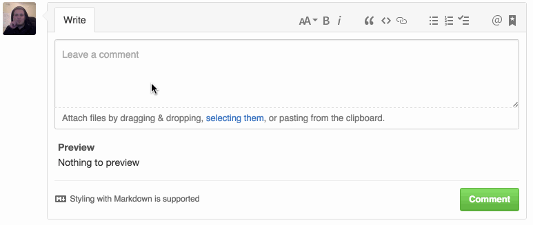

# Octo Preview

A Chrome extension that displays live previews of Markdown comments while you type. Works with Issues + Pull Requests. *Should* support GitHub Enterprise (*but it is currently untested*).

## Todo

- Handle GitHub's not-full-page-reload use-case (likely w/ mutation observers)
- Handle page-load use-case (GH gets values from sessionStorage)
- Port to Firefox
